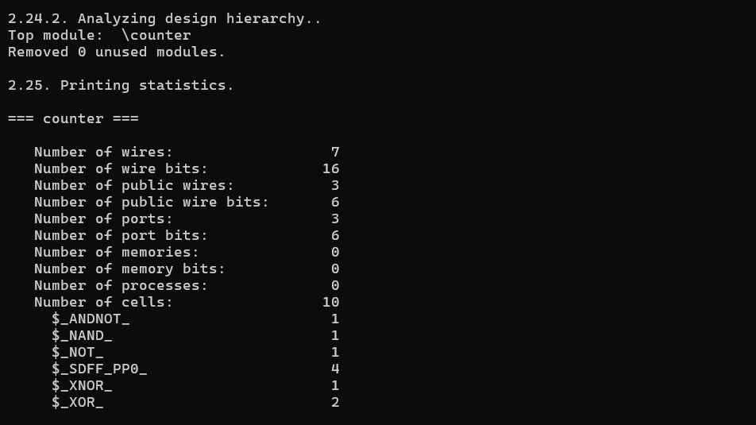
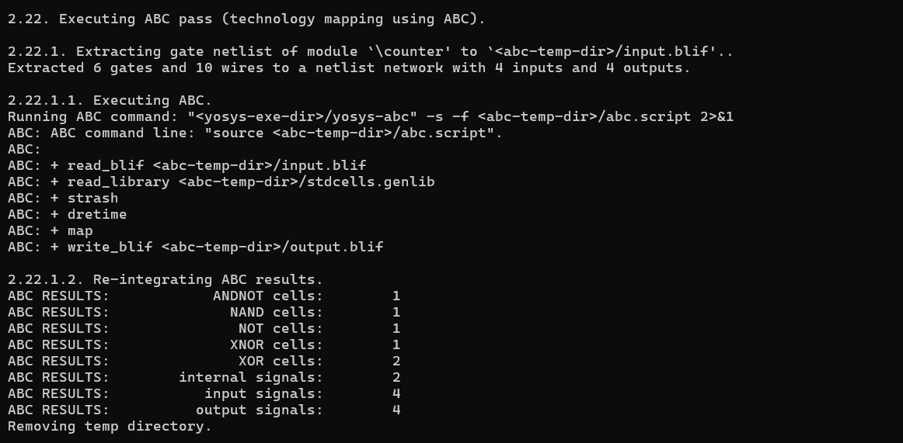
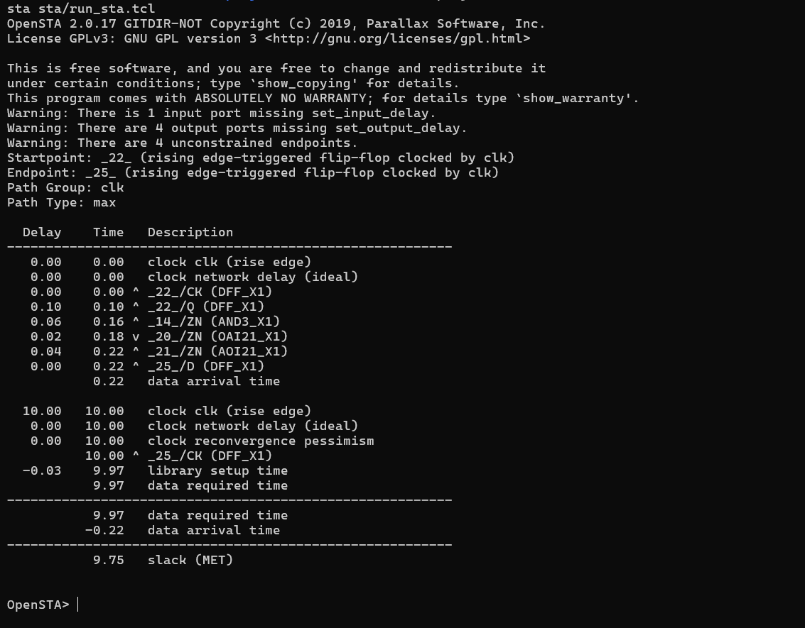

# RTL to Static Timing Analysis (STA) Flow using Yosys & OpenSTA

<p align="center">
  
</p>

## Project Overview

This project demonstrates the complete digital ASIC front-end flow for a simple **4-bit synchronous counter**, starting from RTL design and ending with **Static Timing Analysis (STA)**.

Instead of only writing Verilog code, this project focuses on understanding **how an RTL design is transformed into actual hardware** and how timing analysis is performed on the synthesized gate-level netlist.

The complete flow includes:

```
RTL Design
      │
      ▼
Logic Synthesis (Yosys)
      │
      ▼
Technology Mapping (Nangate Open Cell Library)
      │
      ▼
Gate-Level Netlist
      │
      ▼
Static Timing Analysis (OpenSTA)
      │
      ▼
Timing Report
```

---

# Motivation

While learning Static Timing Analysis, I solved many STA-related problems on paper and studied timing concepts such as setup time, hold time, slack, WNS, TNS, and timing constraints.

I also started learning **Tcl scripting**, but I wanted to understand **how these concepts are actually used in a real design flow** rather than studying them only theoretically.

This project was created to bridge that gap.

By implementing the complete RTL-to-STA flow, I gained a much better understanding of:

- RTL Design
- Logic Synthesis
- Technology Mapping
- Standard Cell Libraries
- Gate-Level Netlists
- Timing Constraints
- Static Timing Analysis
- Industry-style design flow

---

# Tools Used

| Tool | Purpose |
|------|----------|
| Verilog | RTL Design |
| Yosys | Logic Synthesis |
| Nangate Open Cell Library | Standard Cell Library |
| OpenSTA | Static Timing Analysis |
| TCL | STA Automation |
| Ubuntu (WSL) | Development Environment |
| VS Code | Code Editor |

---

# Project Structure

```
Timing-Analysis-using-Yosys-OpenSTA
│
├── docs/
│   ├── ABC_technology_mapping.png
│   ├── timing_report.png
│   └── yosys_synthesis_result.png
│
├── library/
│   └── NangateOpenCellLibrary_typical.lib
│
├── rtl/
│   └── counter.v
│
├── sta/
│   ├── counter.sdc
│   ├── run_sta.tcl
│   └── timing_report.txt
│
├── synthesis/
│   ├── counter_netlist.v
│   ├── counter_nangate.v
│   ├── synth.ys
│   └── synth_nangate.ys
│
├── README.md
└── .gitignore
```

---

# Design Description

The design is a **4-bit synchronous up-counter** with:

- Positive edge-triggered clock
- Active-high synchronous reset
- 4-bit output count

RTL implementation:

```verilog
always @(posedge clk)
begin
    if (rst)
        count <= 4'b0000;
    else
        count <= count + 1;
end
```

---

# Synthesis Flow

The RTL is synthesized using **Yosys**.

Main synthesis steps:

- RTL Parsing
- Process Conversion
- Optimization
- Flip-Flop Inference
- Boolean Optimization
- Logic Mapping
- Netlist Generation

Generated files:

- RTL Netlist
- Technology-Mapped Netlist

---

# Technology Mapping

The synthesized logic is mapped to the **Nangate Open Cell Library**.

Example standard cells inferred:

- DFF_X1
- NAND
- XOR
- XNOR
- NOT
- AOI21
- OAI21

Technology Mapping Output:

<p align="center">

</p>

---

# Static Timing Analysis

Timing analysis is performed using **OpenSTA**.

Timing flow:

- Read Liberty Library
- Read Gate-Level Netlist
- Link Design
- Read SDC Constraints
- Setup Analysis
- Hold Analysis
- Timing Report Generation

---

# Timing Constraints

Clock constraint:

```tcl
create_clock -name clk -period 10 [get_ports clk]
```

---

# Timing Report Summary

The generated timing report includes:

- Setup Analysis
- Hold Analysis
- Arrival Time
- Required Time
- Slack
- Critical Timing Path
- Clock Information

Result:

```
Slack (MET): 9.75 ns
```

This indicates that the design successfully meets the specified timing constraints.

Timing Report:

<p align="center">

</p>

---

# Key Learnings

Through this project, I learned:

- RTL Design using Verilog
- Logic Synthesis using Yosys
- Technology Mapping
- Standard Cell Libraries
- Gate-Level Netlists
- Liberty (.lib) files
- SDC Constraints
- Static Timing Analysis
- Setup and Hold Timing
- Timing Slack
- Critical Path Analysis
- TCL scripting for OpenSTA
- End-to-end RTL to STA flow

---

# How to Run

## Clone Repository

```bash
git clone https://github.com/<your_username>/Timing-Analysis-using-Yosys-OpenSTA.git

cd Timing-Analysis-using-Yosys-OpenSTA
```

---

## RTL Synthesis

```bash
yosys synthesis/synth.ys
```

---

## Technology Mapping

```bash
yosys synthesis/synth_nangate.ys
```

---

## Static Timing Analysis

```bash
sta sta/run_sta.tcl
```

---

# Future Improvements

Planned extensions:

- 8-bit Counter
- ALU Timing Analysis
- FSM Timing Analysis
- Multi-clock Designs
- False Path Constraints
- Multi-cycle Path Constraints
- Clock Uncertainty Analysis
- Pipeline Design Timing
- Larger ASIC Design Examples

---

# References

- Yosys Open Synthesis Suite
- OpenSTA
- Nangate Open Cell Library

---

# Author

**Deeksha Shekhawat**

Electronics and Communication Engineering

Interested in:

- RTL Design
- Static Timing Analysis
- ASIC Front-End Design
- Digital VLSI
- SystemVerilog
- UVM Verification

Feel free to connect or provide suggestions to improve this project.
